# pratikum6

## LATIHAN 1

#### Pada latihan ini mengubah kode menjadi fungsi menggunakan lambda
Untuk perubahan kodenya seperti gambar dibawah ini.
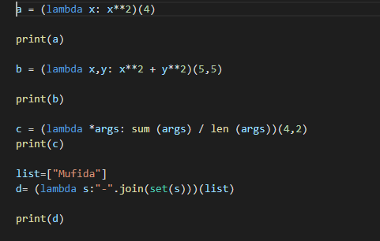

Untuk hasi program saat dijalankan seperti gambar dibawah ini.
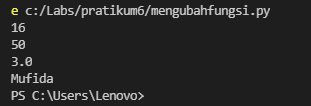

## Pratikum 6

#### Untuk tugas pratikum ini membuat program sederhana dengan menginput data mahasiswa menggunakan fungsi.
1. Berikut adalah flowchart program.
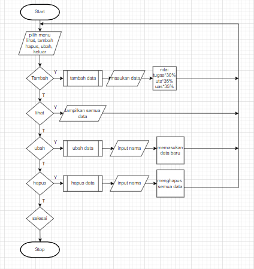
2. dict = [], gunanya untuk menampung data mahasiswa.
3. def tambah():, gunanya untuk menambahkan data mahasiswa.
4. def tampilkann():, gunanya untuk menampilkan data yang sudah ditambagkan.
5. def hapus():, gunanya untuk menghapus data berdasarkan nama.
6. def ubah():, gunanya untuk mengubah data berdasarkan nama.
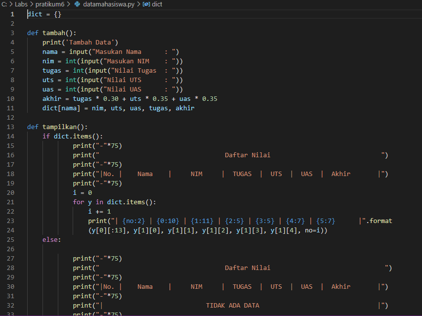
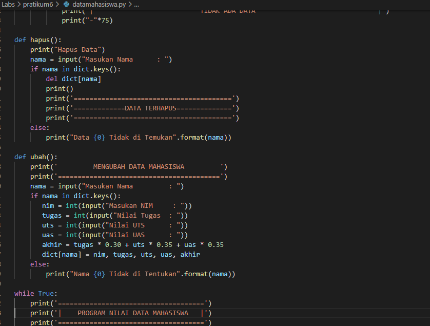
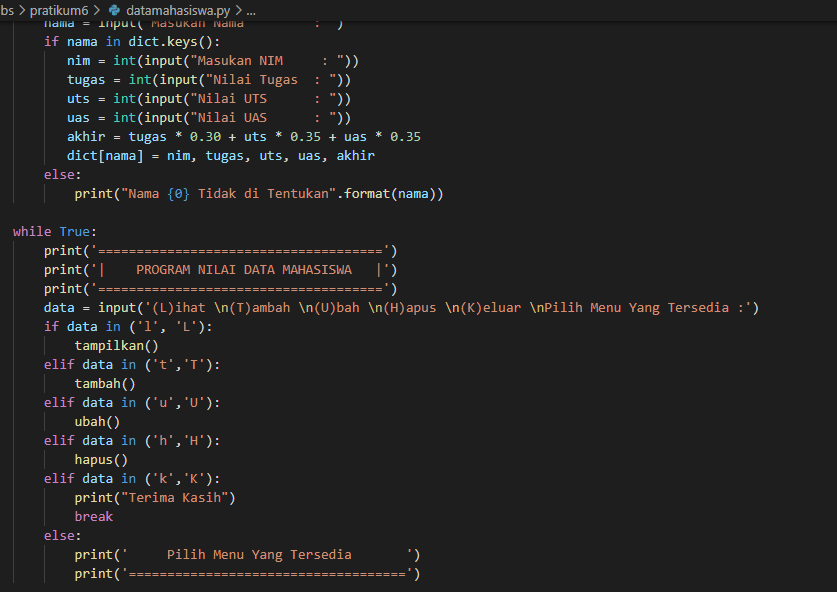

Diatas merupakan kode program untuk menginput data mahasiswa.

7. Tampilan program saat dijalankan dengan perintah tampilkan tampa tambahan data.
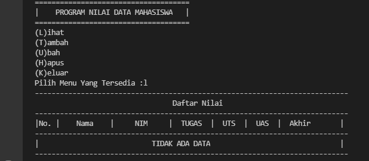
8. Tampilan program saat dijalankan dengan perintah menambahkan data.
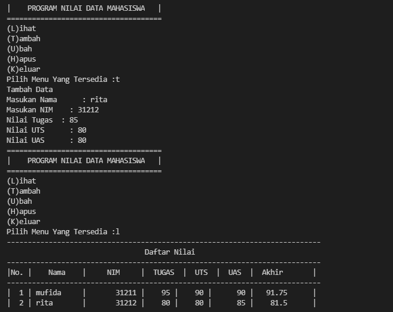
9. Tampilan program saat dijalankan dengan perintah hapus berdasrkan nama.
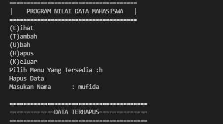
10. Tampilan progam saat dijalankan dengan perintah ubah berdasarkan nama.
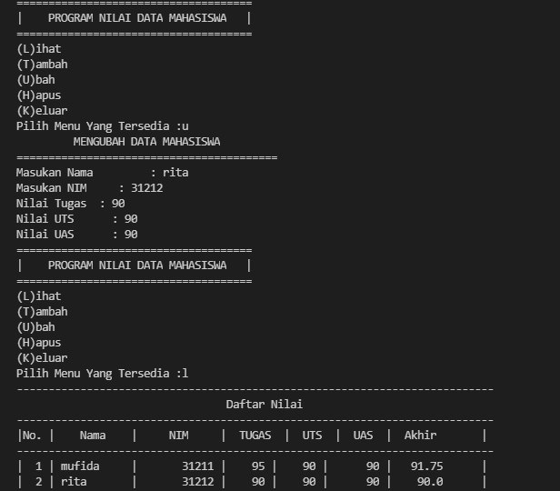
11. Tampilan program saat dijalankan dengan perintah keluar.
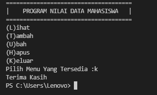
